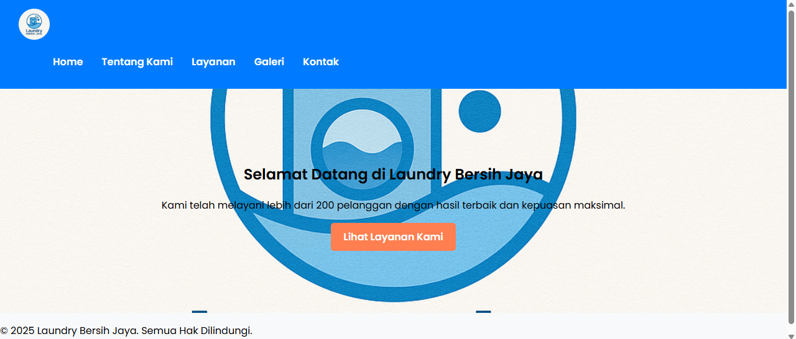

# 🧺 Laundry Bersih Jaya

Selamat datang di proyek **Laundry Bersih Jaya** — website sederhana dan menarik yang dirancang untuk layanan laundry modern dan profesional.

## ✨ Fitur Utama

- 💼 Halaman Beranda dengan tampilan bersih dan informatif
- 📋 Daftar layanan laundry seperti cuci kiloan, setrika, dan lainnya
- 📞 Kontak cepat untuk pemesanan layanan
- 🖼️ Gambar visual menarik yang mencerminkan kualitas layanan
- 📱 Responsif dan mudah digunakan di berbagai perangkat

## 📸 Preview



> Gambar contoh tampilan halaman beranda _(opsional, kamu bisa upload gambar ke GitHub dan link-kan di sini)_

## 🚀 Cara Menjalankan Proyek

1. Clone repositori:

   ```bash
   git clone https://github.com/rahimlearns/laundry-website.git

   ```

2. Buka folder proyek:
   cd laundry-website

3. Buka index.html di browser:
   Klik dua kali index.html, atau

   Buka melalui Live Server di VS Code

🛠️ Struktur Folder
laundry-website/
├── index.html
├── style.css
├── script.js
├── img/
│ └── ... (gambar pendukung)

📌 Teknologi yang Digunakan
HTML5 - Struktur halaman

CSS3 - Desain dan tata letak

JavaScript - Interaksi sederhana

📧 Kontak
Ingin terhubung atau punya pertanyaan?

Email: abdrahimalkautsar484@gmail.com

Instagram: @laundrybersihjaya
